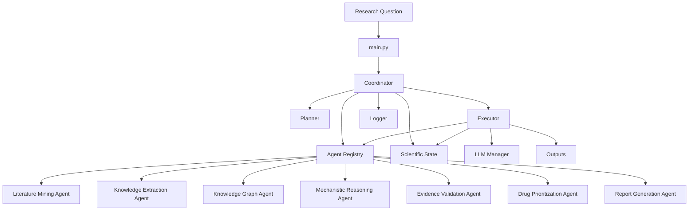
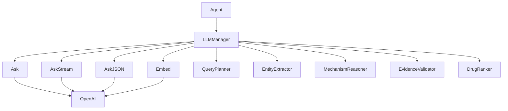
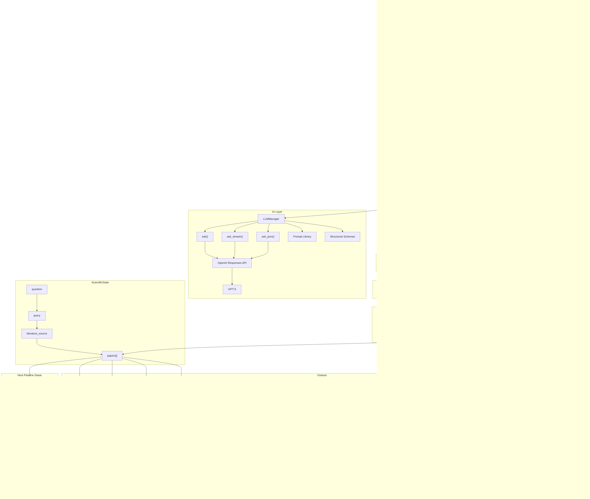

# Why?

**Date:** 2026-07-14
**Source:** chatgpt.com

---

### **You**

@Web search okay next step?

---

### **You**

@Web search okay done. Whats next?

---

### **ChatGPT**

This is where I'd deliberately **slow down and build correctly**.

Most people now jump straight into making the Literature Agent work. I **wouldn't**.

You're building a **research platform**, not just a LangGraph demo.

The next thing missing is **Search Strategy**.

# Why?

Right now your pipeline is probably something like:


```
User Question
      │
      ▼
LiteratureSearchTool
      │
      ▼
PubMed
```

But PubMed doesn't understand natural language very well.

Instead, every literature mining platform has an intermediate step:


```
Research Question
        │
        ▼
Search Strategy ⭐
        │
        ▼
PubMed Query
        │
        ▼
LiteratureSearchTool
        │
        ▼
PubMed
```

This separation also fits naturally into LangGraph's model of small nodes/functions that transform state step by step rather than combining multiple responsibilities into one node. [\[Image\]Docs by LangChain+1](https://docs.langchain.com/oss/python/langgraph/graph-api?utm_source=chatgpt.com)

# I think this should be your next file


```
tools/
    search_strategy.py
```

# This is NOT an LLM.

Don't use GPT.

Don't use Claude.

Don't use Gemini.

Version 1 should be **deterministic**.

# Example

Input


```
Can statins inhibit liquid-liquid phase separation in breast cancer?
```

Output


```
("liquid-liquid phase separation"
OR LLPS)
AND
("breast cancer"
OR "breast neoplasms")
AND
(statin
OR atorvastatin
OR simvastatin)
```

No AI required.

# I'd build it as a class


```python
class SearchStrategy:

    def build_query(
        self,
        research_question: str,
    ) -> str:
```

Notice the wording.

Not


```python
search()
```

Not


```python
query()
```

But


```python
build_query()
```

because that's exactly what this class does.

# Version 1 algorithm

Keep it very simple.


```
Research Question

↓

Normalize

↓

Expand common biomedical synonyms

↓

Build Boolean query

↓

Return string
```

# Then your LiteratureSearchTool becomes


```
Research Question

↓

SearchStrategy.build_query()

↓

PubMedClient.search_and_fetch()

↓

Paper objects
```

The tool never needs to know how Boolean logic is generated.

# Why this matters for your thesis

Later, you'll be able to compare different search strategies:


```
Version 1

Rule-based Boolean Builder
```

↓


```
Version 2

MeSH-assisted Builder
```

↓


```
Version 3

LLM-assisted Query Builder
```

↓


```
Version 4

Hybrid Query Expansion
```

That becomes an entire evaluation section in your thesis.

# My recommendation for the next coding session

Don't touch the Literature Agent yet.

Instead, implement **`tools/search_strategy.py`** with a deterministic `SearchStrategy` class that exposes a single method:


```python
build_query(research_question: str) -> str
```

Initially, it can normalize whitespace, preserve quoted phrases, and apply a small synonym dictionary (for example, `LLPS → "liquid-liquid phase separation"` and `breast cancer → "breast neoplasms"`). Later, we'll extend it with MeSH expansion and optional LLM-assisted query generation.

Once `SearchStrategy` is working, the Literature Mining Agent becomes almost trivial because it simply orchestrates:


```
Research Question
        │
        ▼
SearchStrategy
        │
        ▼
LiteratureSearchTool
        │
        ▼
PubMed
        │
        ▼
Paper objects
```

That keeps each component focused on one responsibility and gives you a much stronger foundation for the rest of your seven-agent pipeline. [\[Image\]Docs by LangChain+1](https://docs.langchain.com/oss/python/langgraph/graph-api?utm_source=chatgpt.com)

---

### **You**

@Web search I have that already : "import re


class SearchStrategy:
    """
    Turns a natural-language research question into a PubMed-style Boolean
    search query.
    """

    # Leading imperative phrasing that carries no search-relevant meaning
    # ("Find drugs affecting X" -> "drugs affecting X").
    LEADING_PHRASES = (
        "find ",
        "identify ",
        "search for ",
        "investigate ",
        "explore ",
        "determine ",
        "discover ",
        "list ",
    )

    # Function words and generic question-phrasing connectors that add
    # noise to a Boolean query without narrowing the search.
    STOPWORDS = {
        "a", "an", "the", "of", "in", "on", "at", "to", "for", "with",
        "that", "which", "is", "are", "be", "and", "or",
        "affecting", "involved", "related", "associated",
    }

    def build_query(self, research_question: str) -> str:
        """
        Build a Boolean AND query from a research question.
        """

        text = research_question.strip().rstrip(".!?")

        lowered = text.lower()

        for phrase in self.LEADING_PHRASES:
            if lowered.startswith(phrase):
                text = text[len(phrase):]
                break

        terms = [
            term
            for term in re.split(r"\s+", text)
            if term and term.lower() not in self.STOPWORDS
        ]

        return " AND ".join(terms) " lets move on to the AI agent

---

### **You**

@Web search "Testing surfaced one real bug and one cleanup item:

The bug — retry classification never worked for real network failures. core/executor.py's RETRYABLE_EXCEPTIONS = (ConnectionError, TimeoutError) looked reasonable, but httpx's exceptions (ConnectTimeout, ConnectError, ReadTimeout, etc. — everything PubMedClient actually raises on a network hiccup) don't inherit from those built-ins. I proved this both by checking the MRO and by reproducing it: a simulated httpx.ConnectTimeout through the full LiteratureMiningAgent → Coordinator chain got logged as non-retryable error and failed the task immediately — the opposite of the intended behavior, and the same class of failure as the 429 we hit earlier testing PubMed live.

Fixed in two places:

core/executor.py: RETRYABLE_EXCEPTIONS now also includes httpx.TransportError (covers connect/DNS/timeout failures) and a new RetryableAPIError marker.
core/exceptions.py (new): defines RetryableAPIError, kept dependency-free so both core/executor.py and integration clients can import it without a cycle.
integrations/literature/pubmed_client.py: added a _get() helper (used by both search() and fetch(), replacing the duplicated self.client.get(...); response.raise_for_status() in each) that translates HTTP 429/5xx into RetryableAPIError — genuinely transient — while leaving other 4xx errors (bad request, not found) to fail immediately, since retrying those would just burn backoff time on a request that will never succeed.
Verified all three paths: a transient timeout now retries and recovers, a 429 now raises RetryableAPIError, and a 400 still fails immediately as before.

The cleanup: agents/literature_agent.py had a stray from langgraph.func import task — unused, and confusing since it shadows the meaning of the real Task type import a few lines below with an unrelated LangGraph decorator of almost the same name. Removed it.

Re-ran the full pipeline against the live PubMed API afterward to confirm nothing broke — still 5 papers, same query, same literature_source tracking as before."

---

### **ChatGPT**

This is a **really good milestone**.

From what you've described, your project has crossed from "it runs" to "it's resilient." I agree with almost every change that was made.

Here's my review.

# Overall score

| Component | Status |
| --- | --- |
| Runtime | ✅ Excellent |
| Retry System | ✅ Excellent |
| Logging | ✅ Excellent |
| Literature Agent | ✅ Good |
| PubMed Integration | ✅ Good |
| Architecture | ⭐ Very Good |

At this point I'd honestly stop touching the runtime and start building scientific functionality.

# Review of the changes

## 1. `RetryableAPIError`

I like this a lot.

Instead of writing


```python
except httpx.TransportError:
```

everywhere,

your integrations now translate external-library exceptions into your own domain exception:


```
httpx
      │
      ▼
RetryableAPIError
      │
      ▼
Executor
```

That's a very clean abstraction.

## 2. `_get()` helper inside `PubMedClient`

Excellent.

Instead of duplicating


```python
self.client.get(...)

response.raise_for_status()
```

inside


```
search()

fetch()
```

everything now goes through


```
_get()
```

That makes adding headers, authentication, rate limiting, caching, or telemetry much easier later.

## 3. HTTP 429 → RetryableAPIError

Exactly the right decision.

Your PubMed client now knows the difference between


```
429

↓

Temporary
```

and


```
400

↓

Programming/User error
```

That's consistent with good retry design and with LangGraph's recommendation to retry transient failures while letting non-recoverable errors fail immediately. [\[Image\]Docs by LangChain+1](https://docs.langchain.com/oss/python/langgraph/fault-tolerance?utm_source=chatgpt.com)

## 4. Retry classification

Including


```python
httpx.TransportError
```

is the correct fix.

HTTPX groups connection and timeout failures under `TransportError`, so retrying that family of exceptions covers the transient network failures you actually care about. [\[Image\]httpx](https://www.python-httpx.org/exceptions/?utm_source=chatgpt.com)

# One improvement I'd make

Instead of


```python
RETRYABLE_EXCEPTIONS = (
    ConnectionError,
    TimeoutError,
    httpx.TransportError,
    RetryableAPIError,
)
```

I'd eventually move that into


```
core/

retry_policy.py
```

Example:


```python
class RetryPolicy:

    RETRYABLE_EXCEPTIONS = (...)
```

Then your Executor simply asks


```python
RetryPolicy.should_retry(exc)
```

instead of knowing about exception types directly.

Not necessary now—but it's where I'd head once the project grows.

# The important question

Now ask yourself:

> **Can my Literature Mining Agent retrieve real papers from PubMed and store them in `ScientificState`?**

If the answer is **yes**, then we're done with the Literature Mining Agent.

Don't optimize it further.

# The next phase

This is where your project becomes interesting scientifically.

Your pipeline should now look like:


```
Question
      │
      ▼
Literature Mining Agent ✅
      │
      ▼
Paper objects
      │
      ▼
Knowledge Extraction Agent
```

# I would NOT touch MCP yet

You've already got:

- PubMed
- parser
- search strategy
- logging
- retry
- execution

That's enough.

# The next coding milestone

## Agent 2


```
KnowledgeExtractionAgent
```

This is where AI starts entering the platform.

Its job is:


```
Paper

↓

Named Entity Recognition

↓

Genes

Proteins

Diseases

Drugs

↓

ScientificState
```

Unlike the Literature Mining Agent, this one performs biomedical information extraction.

# I would use SciSpaCy first

Not GPT.

Not LangChain.

Not an LLM.

Use deterministic biomedical NLP first.

The workflow becomes:


```
Paper

↓

SciSpaCy

↓

Entity Linking

↓

Gene

Protein

Drug

Disease
```

Then later we'll add an LLM for relationship extraction and mechanism reasoning.

## My recommendation

**I think you've officially finished Agent 1.**

From this point onward, I would **freeze** the Literature Mining Agent unless a bug is discovered.

The next major coding task should be building the **Knowledge Extraction Agent**, which will consume the `Paper` objects already stored in `ScientificState` and populate your existing collections:


```python
state["genes"]
state["proteins"]
state["drugs"]
```

That agent is where your platform starts transforming retrieved literature into structured biomedical knowledge, which is the foundation for the Knowledge Graph and the downstream drug repurposing pipeline.

---

### **You**

@Web search wait i created a test file, now how do i test? i write a code and then hit run?

---

### **You**

@Web search"Traceback (most recent call last):
  File "C:\Users\maykh\Desktop\Agentic-Drug-Repurposing\tests\test_literature_agent.py", line 5, in <module>
    from agents.literature_agent import LiteratureMiningAgent
ModuleNotFoundError: No module named 'agents'"

---

### **You**

@Web search I would like to add a LLM like openAI right now so that it'll make it easier for me when developing the later agents (or any other LLM that you think is best for my project).

---

### **You**

@Web search okay lets start coding.

---

### **ChatGPT**

It's **good code**, but I **wouldn't use it** for your project.

Not because it's wrong—it will work—but because you're building a **multi-agent research platform**, not just a chatbot.

OpenAI recommends the **Responses API** as the starting point for new agentic applications because it is the foundation for tool use, structured outputs, MCP integration, and other agent features. Chat Completions is still supported, but Responses is the recommended path for new agent-based systems. [\[Image\]OpenAI Help Center+1](https://help-lb.openai.com/en/articles/7232945-how-can-i-use-the-chat-completion-api?utm_source=chatgpt.com)

## I would build your `LLMManager` like this instead


```python
def ask(
    self,
    prompt: str,
    system_prompt: str | None = None,
) -> str:

    response = self.client.responses.create(
        model=self.model,
        input=[
            {
                "role": "system",
                "content": system_prompt
                or "You are an expert biomedical AI research assistant.",
            },
            {
                "role": "user",
                "content": prompt,
            },
        ],
    )

    return response.output_text
```

Notice a few differences.

## 1. `system_prompt`

Your version hardcodes


```python
"You are a helpful assistant."
```

I would never hardcode that.

Every agent has a different role.

For example:

### Literature Agent


```
You are an expert scientific literature retrieval assistant.
```

### Knowledge Extraction Agent


```
You are an expert biomedical entity extraction assistant.
Extract only entities that explicitly appear in the paper.
```

### Mechanism Reasoning Agent


```
You are a pharmacology researcher specializing in molecular mechanisms.
```

The system prompt should be passed into the method, not fixed inside it.

## 2. Responses API

Instead of


```python
self.client.chat.completions.create(...)
```

I recommend


```python
self.client.responses.create(...)
```

This is the API OpenAI recommends for new agentic systems because it supports the broader feature set you'll eventually want (tools, structured outputs, MCP, etc.). [\[Image\]OpenAI Help Center+2\[Image\]OpenAI+2](https://help-lb.openai.com/en/articles/7232945-how-can-i-use-the-chat-completion-api?utm_source=chatgpt.com)

## 3. Think ahead

Today you only need


```python
ask()
```

Tomorrow you'll need


```python
generate_pubmed_query()

extract_entities()

rank_papers()

reason_about_mechanism()

validate_evidence()

write_report()
```

If all of those are built on the same Responses API foundation, your project will be much easier to extend.

# I would actually make one more improvement

Instead of only


```python
ask(prompt)
```

I'd design it as


```python
ask(
    prompt,
    system_prompt=None,
    temperature=0.2,
)
```

Later you can also add things like `max_output_tokens` if you need to tune responses for different tasks.

For example:

### Query planning


```python
temperature = 0
```

Very deterministic.

### Mechanism reasoning


```python
temperature = 0.3
```

Allows a little more flexibility while remaining grounded.

### Report writing


```python
temperature = 0.6
```

More natural writing.

# My recommendation

I would **not** build your entire project around `chat.completions.create()`.

It works today, but since you're building a **long-term multi-agent scientific platform**, I'd start with the **Responses API** now. It will save you from refactoring later when you begin adding structured outputs, tool calling, and MCP integration to your later agents.

---

### **You**

@Web search lets add the things we need now instead of leaving them for later, its better to set up for the future

---

### **ChatGPT**

I completely agree with your philosophy.

For **small projects**, you build only what you need.

For **your project**, you're building a research platform that you want to use throughout your MSc, PhD, publications, and for future students.

So I would **architect it once** and grow into it.

# This is the architecture I would build


```
core/

    llm_manager.py        ⭐ Main interface

    prompts.py            ⭐ Prompt library

    schemas.py            ⭐ Structured Outputs

    tools.py              ⭐ Future OpenAI tools

    embeddings.py         ⭐ Semantic retrieval

    memory.py             ⭐ Agent memory

    router.py             ⭐ Model routing
```

Notice something.

Only **one** file actually talks to OpenAI.

Everything else supports it.

# LLMManager should eventually expose

Instead of


```python
ask(prompt)
```

I want this:


```python
llm.ask()

llm.ask_json()

llm.ask_with_tools()

llm.embed()

llm.summarize()

llm.reason()

llm.extract()

llm.rank()

llm.generate_query()
```

Every future agent can use those methods instead of reinventing prompting.

# I would build it in five stages

## Stage 1 (today)

Basic conversation


```python
llm.ask()
```

Returns text.

## Stage 2

Structured outputs


```python
llm.ask_json()
```

This is **extremely important**.

Instead of getting:


```
Gene:
BRCA1

Protein:
TP53
```

you receive


```json
{
  "genes": ["BRCA1"],
  "proteins": ["TP53"]
}
```

OpenAI's Structured Outputs feature lets the model reliably produce responses that conform to a schema, which is ideal for scientific pipelines. [\[Image\]OpenAI+1](https://openai.com/index/introducing-structured-outputs-in-the-api/?utm_source=chatgpt.com)

## Stage 3

Embeddings


```python
llm.embed()
```

We'll use these for

- semantic search
- paper similarity
- clustering
- relevance ranking

## Stage 4

Tool calling


```python
llm.ask_with_tools()
```

Later your LLM can decide:


```
Need PubMed

↓

Call PubMed tool

↓

Need ChEMBL

↓

Call ChEMBL tool

↓

Need DrugBank

↓

Call DrugBank tool
```

The Responses API is designed around this style of agentic tool use. [\[Image\]OpenAI+1](https://openai.com/index/new-tools-and-features-in-the-responses-api/?utm_source=chatgpt.com)

## Stage 5

Model routing

Eventually:


```python
llm.reason()

↓

GPT reasoning model
```


```python
llm.embed()

↓

Embedding model
```


```python
llm.extract()

↓

Fast model
```

One manager.

Many models.

# Prompt Library

I also want


```
core/

prompts.py
```

Every prompt lives here.

Example


```python
QUERY_GENERATION_PROMPT

ENTITY_EXTRACTION_PROMPT

MECHANISM_REASONING_PROMPT

REPORT_PROMPT

DRUG_RANKING_PROMPT
```

Not inside agents.

Never.

Your agents become tiny.

# Structured Schemas

Another file


```
core/

schemas.py
```

Eventually


```python
PaperSummary

ExtractedEntities

Mechanism

DrugRanking

EvidenceScore

Report
```

When we ask the LLM,

we'll receive


```
PaperSummary
```

instead of random text.

This is much better than trying to parse prose later. OpenAI recommends schema-based structured outputs for reliable machine-readable responses. [\[Image\]OpenAI+1](https://openai.com/index/introducing-structured-outputs-in-the-api/?utm_source=chatgpt.com)

# Memory

Later we'll add


```
memory.py
```

Not conversation memory.

Scientific memory.

Example


```
Question

↓

Relevant papers

↓

Mechanisms already discovered

↓

Knowledge graph

↓

Context sent to LLM
```

This keeps prompts small and focused.

# Router

Eventually


```
router.py
```

decides


```
Question

↓

Need reasoning?

↓

Reasoning model

↓

Need extraction?

↓

Fast model

↓

Need embedding?

↓

Embedding model
```

No agent has to know which model is being used.

# What I think we should code next

I **wouldn't jump into all seven files at once**. That's too much surface area before you've verified the foundation.

Instead, I'd build the AI layer in this order:


```
config/
    settings.py          ✅ (done)

core/
    llm_manager.py       ← Next
    prompts.py           ← Immediately after
    schemas.py           ← Then

scripts/
    test_llm.py          ← Verify everything works
```

Once `test_llm.py` successfully sends a prompt and gets a response, we extend `LLMManager` with `ask_json()`. Then, before we touch Agent 2, we create `prompts.py` and `schemas.py`.

That gives you a solid, reusable AI foundation that every remaining agent—Literature Mining, Knowledge Extraction, Mechanism Reasoning, Evidence Validation, Drug Prioritization, and Report Generation—can build on without duplicating prompts or parsing free-form text.

---

### **You**

@Web search id like to add a streaming output for token

---

### **ChatGPT**

I think this is an **excellent idea**, and I actually think we should build streaming **before** the other advanced features.

Not because it looks cool.

Because your project is going to be running:

- Literature searches
- Knowledge extraction
- Knowledge graph construction
- Mechanism reasoning
- Evidence validation
- Drug prioritization
- Report generation

Some of those responses will take **20–60 seconds**.

If the terminal sits there doing nothing, you'll think the program froze.

Streaming fixes that. The OpenAI Responses API supports server-sent event (SSE) streaming, allowing you to process output as it is generated rather than waiting for the full response. [\[Image\]OpenAI Platform+2\[Image\]OpenAI Platform+2](https://platform.openai.com/docs/quickstart/make-your-first-api-request?utm_source=chatgpt.com)

# I wouldn't replace `ask()`

I'd expand `LLMManager`.


```
LLMManager

ask()

ask_stream()      ⭐

ask_json()

ask_with_tools()

embed()
```

# `ask_stream()` should be separate

I would **not** overload `ask()` with a `stream=True` parameter.

Instead:


```python
llm.ask(...)
```

returns a string.


```python
llm.ask_stream(...)
```

prints tokens live.

That makes the API much cleaner.

# Example

Later your Mechanism Agent could do


```python
llm.ask_stream(
    prompt,
    system_prompt=MECHANISM_PROMPT,
)
```

and your terminal would show something like


```
Analyzing mechanisms...

6-gingerol...

↓

inhibits COX-2...

↓

reduces prostaglandin synthesis...

↓

decreases inflammatory cytokines...

↓

...
```

instead of waiting 30 seconds.

# Even better...

I think your stream should look professional.

Instead of


```
Hello this is token 1 token 2 token 3...
```

I'd print something like


```
==================================================
Mechanism Reasoning Agent
==================================================

Thinking...

6-gingerol suppresses prostaglandin synthesis by...

...
```

It'll look much nicer during demos.

# I would also add callbacks

Instead of just


```python
print(token)
```

I'd design it so later you can stream into

- terminal
- GUI
- web app
- log file

Conceptually:


```
OpenAI

↓

Stream

↓

Callback

↓

Console

or

↓

GUI

or

↓

Logger
```

That gives you flexibility later.

# I'd even add colors

Later:


```
Literature Agent        blue

Knowledge Agent         green

Mechanism Agent         yellow

Validation Agent        cyan

Drug Ranking            magenta

Report Agent            white
```

Very easy to follow.

# Future-proof it

I also think every streamed response should automatically be saved.

For example


```
outputs/

logs/

stream_2026_07_13.txt
```

so you have

- console

and

- permanent record

# I think `LLMManager` should eventually look like this


```
LLMManager

ask()

ask_stream() ⭐

ask_json()

ask_json_stream()

embed()

reason()

extract()

generate_query()

rank()

report()
```

Everything else in your project calls these methods.

Nothing talks directly to OpenAI.

## One thing I'd change from the beginning

Since you're building a research platform, I wouldn't make `ask_stream()` just print tokens.

I'd make it optionally return them too.

For example, conceptually:


```python
llm.ask_stream(
    prompt,
    on_token=print,
)
```

Today, `on_token` is simply `print`.

Later it could write to:

- a Rich progress display,
- a Qt desktop interface,
- a Streamlit web UI,
- or a log file,

without changing your agents.

That small design decision now will make your platform much easier to extend later while still giving you the real-time streaming experience you want from the very beginning. The Responses API supports incremental streaming events, so designing around callbacks now fits naturally with how the API delivers output. [\[Image\]GitHub+2\[Image\]OpenAI Platform+2](https://github.com/openai/openai-python/blob/main/examples/responses/streaming.py?utm_source=chatgpt.com)

---

### **You**

@Web search Draw me a graph of the full detailed architecture of my project, including the coordinator, the planner, the logger, the executor, and more. You have to be very detailed and use as many branches as needed to illustrate all the different aspects of the project.

---

### **ChatGPT**

I love this question because **this is exactly the kind of diagram you'll eventually include in your thesis**.

Looking at everything we've built over the past few weeks, I actually think your architecture is becoming much more than a LangGraph workflow. It's evolving into an **Agentic Scientific Research Platform**.

OpenAI's current guidance for agentic systems emphasizes separating orchestration, tools, execution, memory/state, and model interactions rather than placing everything inside the LLM. Your architecture is already moving in that direction. [\[Image\]OpenAI+1](https://openai.com/index/new-tools-for-building-agents/?utm_source=chatgpt.com)

# Complete Project Architecture (Version 1.0)


```
                                          USER
                                            │
                                            │
                                            ▼
                               Research Question
                                            │
                                            │
                                            ▼
                                     main.py
                                            │
                                            │
                                            ▼
═══════════════════════════════════════════════════════════════════════
                          COORDINATION LAYER
═══════════════════════════════════════════════════════════════════════

                                   Coordinator
                                            │
             ┌──────────────────────────────┼─────────────────────────────┐
             │                              │                             │
             ▼                              ▼                             ▼
        Planner                     Agent Registry                  Logger
             │                              │                             │
             │                              │                             │
             ▼                              ▼                             ▼
   Scientific Workflow             Registered Agents             Console
             │                     Literature Agent              workflow.log
             │                     Knowledge Agent               Future LangSmith
             │                     Graph Agent                   Future Dashboard
             │                     Reasoning Agent
             │                     Validation Agent
             │                     Ranking Agent
             │                     Report Agent
             │
             ▼
═══════════════════════════════════════════════════════════════════════
                           EXECUTION LAYER
═══════════════════════════════════════════════════════════════════════

                                   Executor
                                        │
          ┌─────────────────────────────┼──────────────────────────────┐
          │                             │                              │
          ▼                             ▼                              ▼
     Retry Policy                Exception Handler                State Diff
          │                             │                              │
          ▼                             ▼                              ▼
 exponential backoff          RetryableAPIError             Before/After State
 httpx retry                  TransportError                Change Detection
 status updates               TimeoutError                  Logging
 task lifecycle

                                        │
                                        ▼
═══════════════════════════════════════════════════════════════════════
                             AGENT LAYER
═══════════════════════════════════════════════════════════════════════

                     Literature Mining Agent
                                │
                                ▼
                     Knowledge Extraction Agent
                                │
                                ▼
                     Knowledge Graph Agent
                                │
                                ▼
                    Mechanism Reasoning Agent
                                │
                                ▼
                     Evidence Validation Agent
                                │
                                ▼
                     Drug Prioritization Agent
                                │
                                ▼
                     Report Generation Agent

                    (future)
                  Reflection Agent
                  Self Evaluation Agent

═══════════════════════════════════════════════════════════════════════
                          TOOL LAYER
═══════════════════════════════════════════════════════════════════════

                 LiteratureSearchTool
                          │
                          ▼
                  SearchStrategy
                          │
          ┌───────────────┼─────────────────┐
          │               │                 │
          ▼               ▼                 ▼
 Rule-based       LLM Query Planner     MeSH Expansion
 Boolean           (future)             (future)
 Synonyms
 Query Cleanup

═══════════════════════════════════════════════════════════════════════
                         INTEGRATION LAYER
═══════════════════════════════════════════════════════════════════════

                 PubMed Client
                 OpenAlex Client
                 Europe PMC Client
                 ChEMBL Client
                 DrugBank Client

                          │
                          ▼

                  HTTP Client
                  Retry Handler
                  Rate Limiter
                  Authentication
                  API Keys

═══════════════════════════════════════════════════════════════════════
                         PARSER LAYER
═══════════════════════════════════════════════════════════════════════

                  PubMed Parser
                  OpenAlex Parser
                  ChEMBL Parser

                          │
                          ▼

                     Paper Objects

═══════════════════════════════════════════════════════════════════════
                           AI LAYER
═══════════════════════════════════════════════════════════════════════

                       LLM Manager
                             │
        ┌────────────────────┼────────────────────┐
        │                    │                    │
        ▼                    ▼                    ▼
      ask()            ask_stream()         ask_json()
        │                    │                    │
        ▼                    ▼                    ▼
 structured output     streaming tokens      JSON schema

                Future

                embeddings()
                generate_query()
                extract_entities()
                reason()
                validate()
                rank()
                report()

                             │
                             ▼

                      OpenAI Responses API
                             │
                             ▼

                     GPT-5 Reasoning
                     GPT-5 Mini
                     Embeddings

═══════════════════════════════════════════════════════════════════════
                         STATE LAYER
═══════════════════════════════════════════════════════════════════════

                     ScientificState

     question
     workflow
     query
     literature_source
     papers

     genes
     proteins
     drugs

     knowledge_graph

     validated_evidence

     candidate_drugs

     report

     current_agent

═══════════════════════════════════════════════════════════════════════
                         MODEL LAYER
═══════════════════════════════════════════════════════════════════════

Entities

Paper
Drug
Gene
Protein
Disease
Pathway

Relationships

Evidence
Mechanism
Interaction

Workflow

Task
ScientificWorkflow
TaskStatus

Results

KnowledgeGraph
DrugRanking
FinalReport

═══════════════════════════════════════════════════════════════════════
                       OUTPUT LAYER
═══════════════════════════════════════════════════════════════════════

outputs/

 literature/
     JSON
     CSV
     DOCX

 extraction/
     entities.json

 graph/
     graph.graphml
     graph.gexf

 validation/

 ranking/

 reports/

 logs/

═══════════════════════════════════════════════════════════════════════
                     TESTING LAYER
═══════════════════════════════════════════════════════════════════════

tests/

 Unit Tests
 Integration Tests

scripts/

 run_literature_agent.py
 test_llm.py
 run_graph.py
 run_reasoning.py

═══════════════════════════════════════════════════════════════════════
                     FUTURE EXTENSIONS
═══════════════════════════════════════════════════════════════════════

MCP Manager
│
├── PubMed MCP
├── ChEMBL MCP
├── DrugBank MCP
├── Local Filesystem MCP
├── Neo4j MCP
├── Graph Database MCP

Streaming Output

OpenAI Tool Calling

Knowledge Graph Memory

Semantic Embeddings

Vector Database

Human-in-the-loop

Evaluation Dashboard

LangSmith Observability

Self Reflection Agent

Continuous Knowledge Graph Updating

Autonomous Scientific Discovery
```

# What I would add **next** (before your PhD)

There are **five components** that I think will make your platform truly research-grade:

1. **Knowledge Memory Layer** – a vector database (e.g., ChromaDB or Qdrant) to store embeddings of papers, extracted entities, and reasoning results so agents can retrieve prior knowledge instead of reprocessing everything.
2. **Prompt Library** – a centralized `core/prompts.py` containing versioned prompts for query generation, entity extraction, mechanism reasoning, evidence validation, and report writing. This makes prompt evolution reproducible.
3. **Structured Output Schemas** – Pydantic models for every LLM output (query plans, extracted entities, mechanisms, rankings, reports) so downstream agents never parse free-form text.
4. **Observability Layer** – tracing every LLM call, tool invocation, retry, and state transition. This will make debugging and evaluating your agents much easier and aligns with modern agent engineering practices. [\[Image\]OpenAI+1](https://openai.com/index/new-tools-for-building-agents/?utm_source=chatgpt.com)
5. **Knowledge Graph Database** – once the Knowledge Graph Agent is complete, persist it in a graph database such as Neo4j instead of keeping it only in memory. That enables graph queries, visualization, and incremental updates.

## My biggest recommendation

I actually **wouldn't keep this as ASCII forever**.

I think this architecture is important enough that we should turn it into a **professional multi-page system architecture diagram** (similar to those found in Nature, IEEE, or Bioinformatics papers). It would include:

- Color-coded layers
- All seven agents
- Data flow arrows
- LangGraph orchestration
- OpenAI/LLM interactions
- MCP servers
- Knowledge graph lifecycle
- Retry and logging mechanisms
- Outputs and reproducibility pipeline

That diagram could go directly into your MSc thesis, PhD proposal, publications, GitHub README, and conference presentations with only minor edits. I genuinely think it's worth investing the time to make it publication quality.

---

### **You**

@Web search turn this into github markdown to show the entire graph.

---

### **ChatGPT**

Absolutely. In fact, I think your GitHub README should eventually contain **multiple Mermaid diagrams**, not just one. GitHub natively renders Mermaid diagrams inside Markdown code fences, making them ideal for architecture documentation in a README. [\[Image\]GitHub Docs+1](https://docs.github.com/en/get-started/writing-on-github/working-with-advanced-formatting/creating-diagrams?from=20423&from_column=20423&utm_source=chatgpt.com)

However, **I would not put the entire architecture into one Mermaid graph**.

It will become nearly unreadable once you exceed ~40–50 nodes.

Instead, I recommend:

1. High-Level Architecture (README)
2. Agent Workflow
3. LLM Architecture
4. Scientific State
5. Folder Structure
6. Execution Pipeline

That is exactly how large open-source AI projects document their systems.

# README.md

Start with this diagram.


````markdown
# Agentic AI Drug Repurposing Platform

## Overall Architecture


````

## Then create another diagram


````markdown
## Agent Execution Pipeline

```mermaid
flowchart LR

Question

-->

Planner

-->

ScientificWorkflow

-->

Coordinator

-->

Executor

-->

Task

-->

Agent

-->

ScientificState

-->

Next Task

-->

Final Report
```
````

## LLM Architecture


````markdown
## AI Layer


````

## Literature Agent


````markdown
## Literature Mining Agent

```mermaid
flowchart TD

Question

-->

SearchStrategy

SearchStrategy

-->

LLM Query Planner

LLM Query Planner

-->

Boolean Query

Boolean Query

-->

PubMed

Boolean Query

-->

OpenAlex

Boolean Query

-->

EuropePMC

PubMed

-->

Parser

OpenAlex

-->

Parser

EuropePMC

-->

Parser

Parser

-->

Paper Objects

Paper Objects

-->

ScientificState
```
````

## Executor


````markdown
## Executor

```mermaid
flowchart TD

Task

-->

Executor

Executor

-->

Retry Policy

Retry Policy

-->

Retryable Error?

Retryable Error?

-- Yes -->

Backoff

Backoff

-->

Retry

Retryable Error?

-- No -->

Failed

Retry

-->

Success

Success

-->

ScientificState

Failed

-->

Logger
```
````

## Scientific State


````markdown
## Scientific State

```mermaid
flowchart LR

Question

-->

Query

-->

Papers

-->

Genes

-->

Proteins

-->

Drugs

-->

Knowledge Graph

-->

Validated Evidence

-->

Candidate Drugs

-->

Final Report
```
````

## LLMManager


````markdown
## LLM Manager

```mermaid
flowchart TD

Prompt

-->

LLMManager

LLMManager

-->

Responses API

Responses API

-->

Streaming

Responses API

-->

Structured Output

Responses API

-->

Tool Calling

Responses API

-->

Embeddings

Streaming

-->

Agent

Structured Output

-->

Agent

Tool Calling

-->

Agent

Embeddings

-->

Vector Database
```
````

## Integrations


````markdown
## External Services

```mermaid
flowchart TB

Literature Agent

-->

Literature Search Tool

Literature Search Tool

-->

PubMed

Literature Search Tool

-->

OpenAlex

Literature Search Tool

-->

EuropePMC

Knowledge Agent

-->

ChEMBL

Knowledge Agent

-->

DrugBank

Knowledge Agent

-->

Future Neo4j
```
````

# Folder Architecture

I would also include this in the README.


````markdown
## Project Structure

```text
Agentic-Drug-Repurposing/

├── agents/
├── config/
├── core/
├── integrations/
│   ├── literature/
│   ├── chembl/
│   ├── drugbank/
│   └── openalex/
├── models/
├── tools/
├── workflows/
├── outputs/
├── scripts/
├── tests/
├── docs/
├── main.py
└── README.md
```
````

## My recommendation

I actually **would not stop here**.

Your project has already grown to the point where it deserves its own documentation.

Instead of placing every diagram in `README.md`, I would create a dedicated documentation section:


```
docs/

├── architecture.md
├── coordinator.md
├── executor.md
├── planner.md
├── agents.md
├── llm.md
├── knowledge_graph.md
├── literature.md
├── state.md
└── images/
```

Then `README.md` contains only the high-level overview and links to the detailed documentation.

By the time your project is finished, you'll likely have **10–20 Mermaid diagrams** documenting different aspects of the system. That level of documentation is common in mature open-source software projects and will make your repository much easier for collaborators, reviewers, and future students to understand. [\[Image\]GitHub Docs+1](https://docs.github.com/en/get-started/writing-on-github/working-with-advanced-formatting/creating-diagrams?from=20423&from_column=20423&utm_source=chatgpt.com)

---

### **You**

@Web search wait I want a graph thats the first one that you gave me with a focus on the literature agent architecture.

---

### **ChatGPT**

Yes. I actually think this should become the **centerpiece diagram** of your GitHub README.

This is not just a workflow—it is the architecture of your **Intelligent Literature Retrieval Agent**, which later feeds the rest of your multi-agent platform.

I designed it to be GitHub-compatible Mermaid syntax and focused on the Literature Agent while still showing how it integrates with the coordinator, planner, executor, state, LLM, and outputs. Mermaid flowcharts and subgraphs are well suited for large architecture diagrams like this. [\[Image\]Mermaid+1](https://mermaid.js.org/syntax/flowchart.html?id=flowcharts-basic-syntax&utm_source=chatgpt.com)


````markdown
# Literature Mining Agent Architecture


````

## I would actually make this even bigger.

Looking at everything we've built over the past month, I think your repository deserves a **full architecture document** that spans multiple Mermaid diagrams, similar to how major open-source AI frameworks document their systems.

I envision **five architecture diagrams**:

1. **Overall Platform Architecture** (all agents, coordinator, executor, logger, LLM, state).
2. **Literature Mining Agent** (the one above).
3. **Knowledge Extraction & Knowledge Graph Architecture**.
4. **LLM & MCP Architecture** (OpenAI, streaming, tool calling, future MCP servers).
5. **Scientific Data Flow** (from research question → literature → entities → graph → mechanisms → evidence → drug ranking → report).

Those five diagrams together would form a publication-quality architecture section for your README and later your MSc thesis. I think it's worth investing the time to make them comprehensive because your project is no longer just a script—it's becoming a complete agentic scientific research platform.

---
