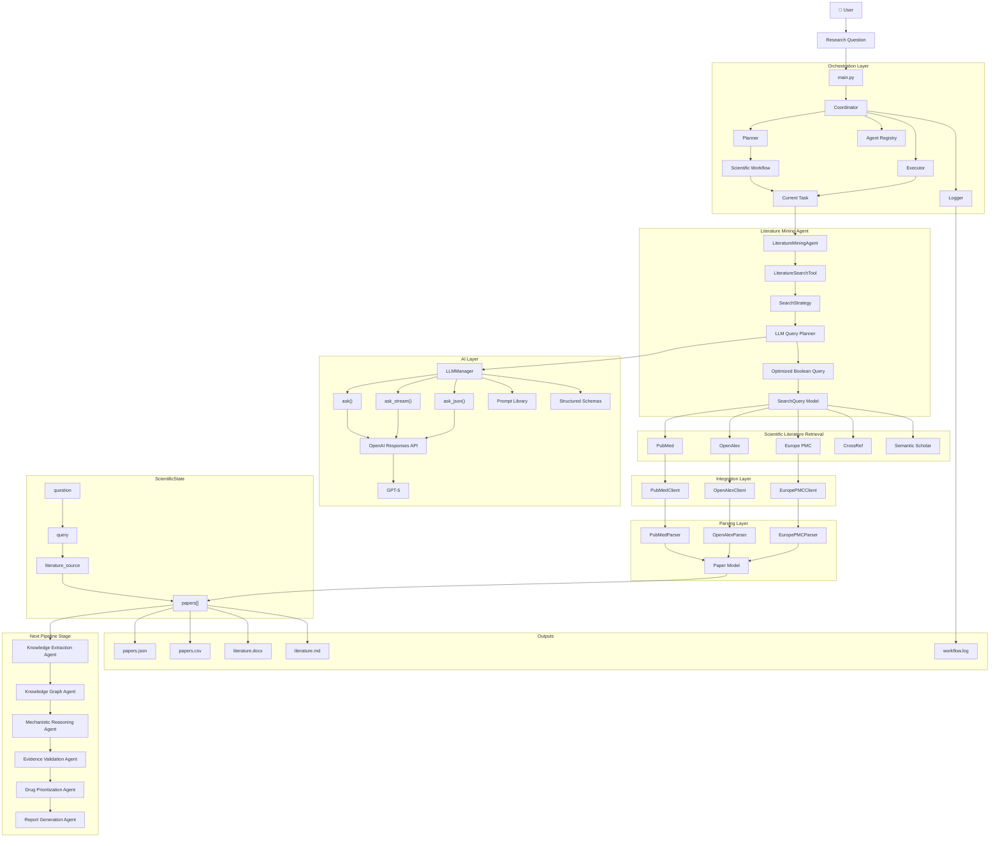

# Graph of the overall workflow

# Literature Mining Agent Architecture

```mermaid
flowchart TB

%% =====================================================
%% USER
%% =====================================================

USER["👤 User"]

QUESTION["Research Question"]

USER --> QUESTION

%% =====================================================
%% ORCHESTRATION
%% =====================================================

subgraph ORCH["Orchestration Layer"]

MAIN["main.py"]

COORD["Coordinator"]

PLANNER["Planner"]

EXECUTOR["Executor"]

LOGGER["Logger"]

REGISTRY["Agent Registry"]

WORKFLOW["Scientific Workflow"]

TASK["Current Task"]

MAIN --> COORD

COORD --> LOGGER

COORD --> PLANNER

COORD --> EXECUTOR

COORD --> REGISTRY

PLANNER --> WORKFLOW

WORKFLOW --> TASK

EXECUTOR --> TASK

end

QUESTION --> MAIN

%% =====================================================
%% LITERATURE AGENT
%% =====================================================

subgraph LIT["Literature Mining Agent"]

AGENT["LiteratureMiningAgent"]

SEARCH_TOOL["LiteratureSearchTool"]

SEARCH_STRATEGY["SearchStrategy"]

LLM_QUERY["LLM Query Planner"]

BOOLEAN["Optimized Boolean Query"]

QUERY_OBJECT["SearchQuery Model"]

AGENT --> SEARCH_TOOL

SEARCH_TOOL --> SEARCH_STRATEGY

SEARCH_STRATEGY --> LLM_QUERY

LLM_QUERY --> BOOLEAN

BOOLEAN --> QUERY_OBJECT

end

TASK --> AGENT

%% =====================================================
%% AI LAYER
%% =====================================================

subgraph AI["AI Layer"]

LLM_MANAGER["LLMManager"]

ASK["ask()"]

STREAM["ask_stream()"]

JSON["ask_json()"]

PROMPTS["Prompt Library"]

SCHEMAS["Structured Schemas"]

OPENAI["OpenAI Responses API"]

GPT["GPT-5"]

LLM_MANAGER --> ASK

LLM_MANAGER --> STREAM

LLM_MANAGER --> JSON

LLM_MANAGER --> PROMPTS

LLM_MANAGER --> SCHEMAS

ASK --> OPENAI

STREAM --> OPENAI

JSON --> OPENAI

OPENAI --> GPT

end

LLM_QUERY --> LLM_MANAGER

%% =====================================================
%% DATABASE SEARCH
%% =====================================================

subgraph SEARCH["Scientific Literature Retrieval"]

PUBMED["PubMed"]

OPENALEX["OpenAlex"]

EUROPEPMC["Europe PMC"]

CROSSREF["CrossRef"]

SEMANTIC["Semantic Scholar"]

QUERY_OBJECT --> PUBMED

QUERY_OBJECT --> OPENALEX

QUERY_OBJECT --> EUROPEPMC

QUERY_OBJECT --> CROSSREF

QUERY_OBJECT --> SEMANTIC

end

%% =====================================================
%% API CLIENTS
%% =====================================================

subgraph CLIENTS["Integration Layer"]

PUBCLIENT["PubMedClient"]

OPENCLIENT["OpenAlexClient"]

EUCLIENT["EuropePMCClient"]

PUBMED --> PUBCLIENT

OPENALEX --> OPENCLIENT

EUROPEPMC --> EUCLIENT

end

%% =====================================================
%% PARSERS
%% =====================================================

subgraph PARSER["Parsing Layer"]

PUBPARSER["PubMedParser"]

OPENPARSER["OpenAlexParser"]

EUPARSER["EuropePMCParser"]

PAPER["Paper Model"]

PUBCLIENT --> PUBPARSER

OPENCLIENT --> OPENPARSER

EUCLIENT --> EUPARSER

PUBPARSER --> PAPER

OPENPARSER --> PAPER

EUPARSER --> PAPER

end

%% =====================================================
%% SCIENTIFIC STATE
%% =====================================================

subgraph STATE["ScientificState"]

QUESTION_STATE["question"]

QUERY_STATE["query"]

SOURCE_STATE["literature_source"]

PAPERS["papers[]"]

QUESTION_STATE --> QUERY_STATE

QUERY_STATE --> SOURCE_STATE

SOURCE_STATE --> PAPERS

end

PAPER --> PAPERS

%% =====================================================
%% OUTPUTS
%% =====================================================

subgraph OUTPUT["Outputs"]

JSON_OUT["papers.json"]

CSV_OUT["papers.csv"]

WORD_OUT["literature.docx"]

MARKDOWN_OUT["literature.md"]

LOG_OUT["workflow.log"]

end

PAPERS --> JSON_OUT

PAPERS --> CSV_OUT

PAPERS --> WORD_OUT

PAPERS --> MARKDOWN_OUT

LOGGER --> LOG_OUT

%% =====================================================
%% NEXT AGENT
%% =====================================================

subgraph NEXT["Next Pipeline Stage"]

ENTITY["Knowledge Extraction Agent"]

ENTITY_GRAPH["Knowledge Graph Agent"]

MECH["Mechanistic Reasoning Agent"]

VALID["Evidence Validation Agent"]

RANK["Drug Prioritization Agent"]

REPORT["Report Generation Agent"]

end

PAPERS --> ENTITY

ENTITY --> ENTITY_GRAPH

ENTITY_GRAPH --> MECH

MECH --> VALID

VALID --> RANK

RANK --> REPORT
```
